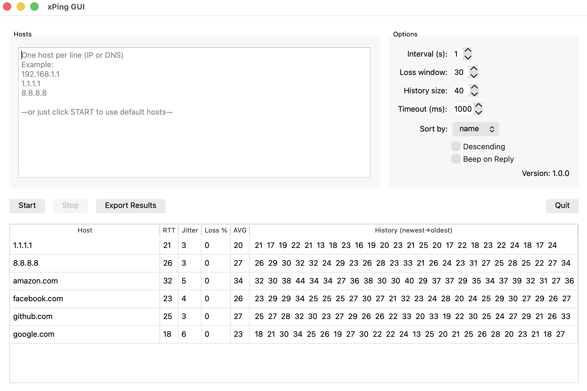
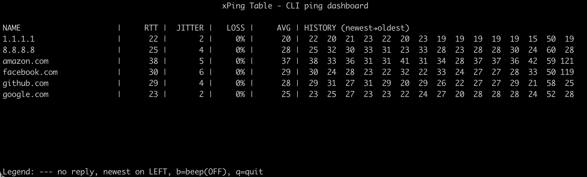

# xPing

**xPing** is a cross-platform, real-time network monitor written in Python.  
It visualizes latency, jitter, and packet loss across multiple hosts — either as an **ASCII dashboard in your terminal** or through a **modern PyQt6 GUI**.



---

## Features

- **Dual Interface**
   - **CLI Mode**: A curses-based dashboard for live, compact terminal monitoring.
   - **GUI Mode**: A PyQt6 interface with sorting, export, and configurable options.
- **Realtime Statistics**
   - RTT (Round Trip Time)
   - Jitter
   - Packet Loss %
   - Rolling Average (AVG)
- **Beep Support**
   - Optional audible beep on successful replies (`--beep` or checkbox in GUI).
- **Smart History**
   - Left-anchored display (newest → oldest)
   - Adjustable sample size and refresh rate.
- **Export Results**
   - Save session summaries to `.txt` after stopping the GUI monitor.
- **Cross-Platform**
   - macOS, Linux, and Windows (with `windows-curses`).

---

## Installation

Clone the repo and install dependencies:

```bash
git clone https://github.com/cculver78/xPing.git
cd xping
pip install -r requirements.txt
```

**Requirements**

```text
pyqt6
windows-curses; platform_system == "Windows"
uvloop; platform_system != "Windows"
```

---

## Command-Line Mode

Run the curses-based dashboard:

```bash
python xping.py --hosts 1.1.1.1 8.8.8.8 github.com
```

### CLI Options

| Flag | Description |
|------|--------------|
| `--hosts` | Space-separated list of hosts to ping |
| `--interval` | Ping interval in seconds |
| `--loss-window` | Number of samples used for loss calculation |
| `--hist-size` | History buffer length |
| `--timeout-ms` | Timeout per ping (milliseconds) |
| `--sort` | Sort by `name`, `rtt`, `loss`, or `jitter` |
| `--descending` | Reverse sort order |
| `--beep` | Enable beep on successful replies |
| `--json` | Stream structured JSON output for GUI mode |
| `--version` | Show version and exit |

**Example**

```bash
python xping.py --hosts 1.1.1.1 8.8.8.8 --interval 1 --beep
```

**Keyboard Shortcuts**
| Key | Action |
|-----|---------|
| `q` | Quit |
| `b` | Toggle beep mode |

---

## 🪟 GUI Mode

Launch the graphical interface:

```bash
python xping_gui.py
```

### GUI Features
- Enter custom hosts or click **Start** to use defaults.
- Adjust interval, timeout, and history size.
- Enable “Beep on Reply” for audible feedback.
- Sort dynamically by name, RTT, loss, jitter, or average.
- Click **Stop** to end monitoring and reveal the **Export** button.
- Export session stats to `xping_results.txt`.



---

## Exported Output Example

```text
xPing Results
====================

Host                    RTT    Jitter     Loss%       AVG
--------------------------------------------------------------
1.1.1.1                  12         1         0        11
8.8.8.8                  18         2         0        15
github.com               42         6         0        36
```

---

## Architecture Overview

```
+-------------+          +---------------+
|  xping_gui  | <------> |   xping CLI   |
|  PyQt6 app  |   JSON   |  asyncio ping |
+-------------+          +---------------+
```

- The CLI runs an asyncio-driven ICMP ping loop.
- The GUI spawns the CLI in `--json` mode and updates a live table.
- Beep and export are handled independently per mode.

---

## License
Released under the **MIT License** — free to use, modify, and share, provided the original copyright notice and credit to **Charles Culver** remain.

---

## Author

**Charles "Chuck" Culver**  
[GitHub](https://github.com/cculver78) • [Bluesky](https://bsky.app/profile/dhelmet78.bsky.social) • [Threads](https://www.threads.com/@cculver78)

---
